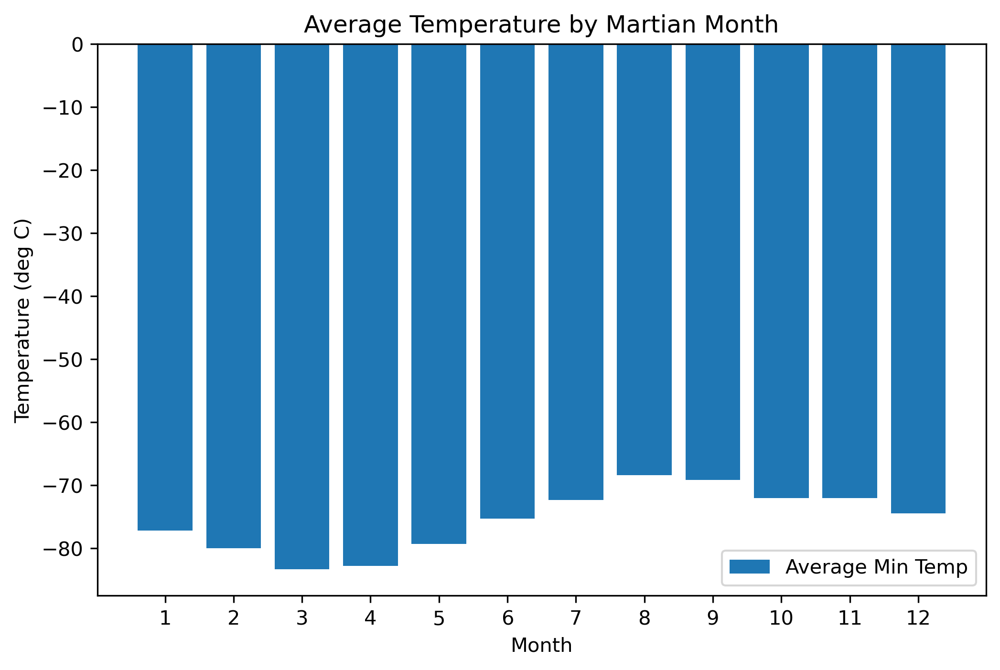
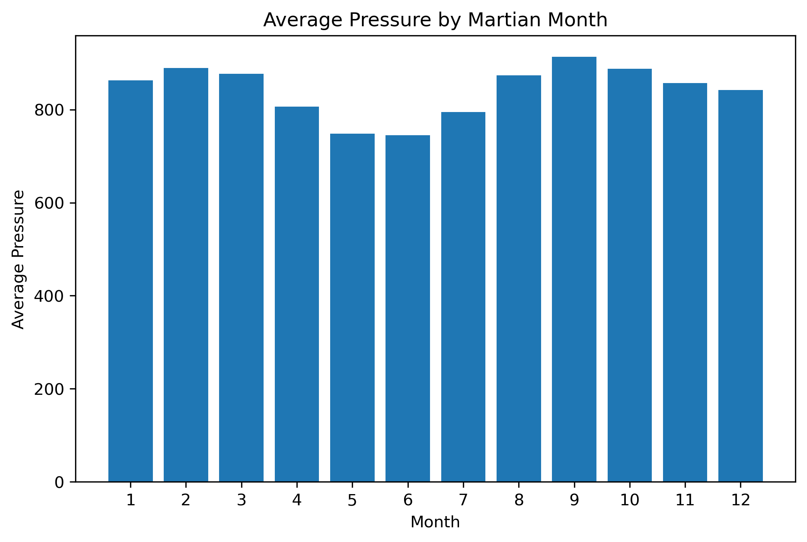
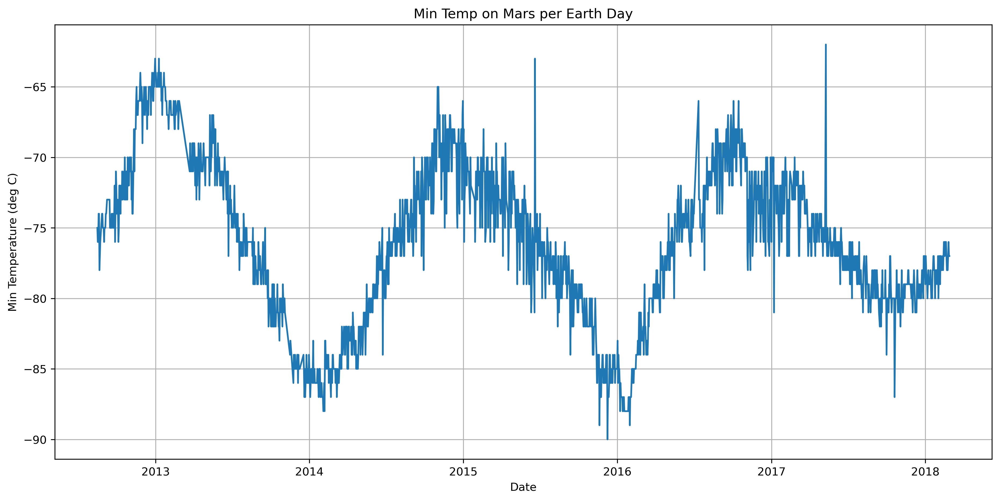

# Mars Data - Scraping and Analysis - Challenge

## Background

Scraping and analyzing websites with Mars news and weather facts.

## Data Source

1. [Mars News Website](https://static.bc-edx.com/data/web/mars_news/index.html)

2. [Mars Weather Facts Website](https://static.bc-edx.com/data/web/mars_facts/temperature.html)

## Project Deliverables

### 1. Deliverable 1: Scrape titles and preview text from Mars news articles.

a. Automated browsing to visit the Mars news site and Extract Data

b. The titles and preview text of the news articles

### 2. Deliverable 2: Scrape and analyze Mars weather data.

a. HTML table extracted into a Pandas DataFrame

b. Answers to the following questions:

 - How many months exist on Mars?
     - 12 Months
     
 - How many Martian days' worth of data are there? 
     - The number of Martian days (sols) for which data was collected: 1977

c. Data and visualizations to answer the following questions:

 - Which month, on average, has the lowest temperature? The highest? 
    - The coldest month on Mars is: 3
    - The hottest month on Mars is: 8

    
 - Which month, on average, has the lowest atmospheric pressure? The highest?
    - The lowest pressure month on Mars is: 6
    - The highest pressure month on Mars is: 9

 - How many terrestrial days exist in a Martian year?
    - The peak to peak duration is just under two year, a visual extimate is 700 Earth days per Martian Year

d. [CSV with the data](https://github.com/Ahmadhha/scraping_and_analysis-challenge/tree/main/Output) 

### Shortcuts

- [Mars News Notebook](https://github.com/fabiomarcullo/web-scraping-challenge/blob/main/part_1_mars_news.ipynb)

- [Mars Weather Facts Notebook](https://github.com/fabiomarcullo/web-scraping-challenge/blob/main/part_2_mars_weather.ipynb)
